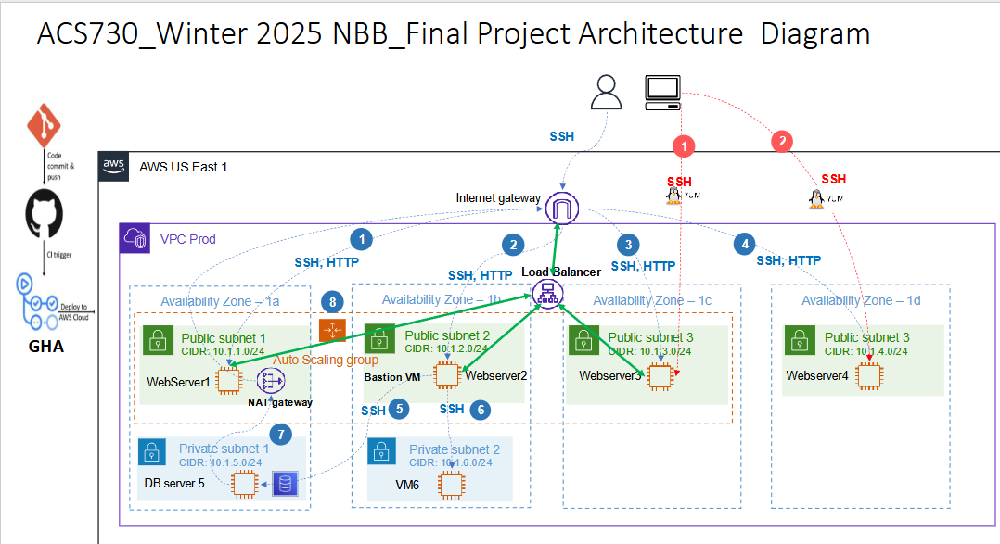

# 🚀 Two-Tier Web Application Automation with Terraform, Ansible, and GitHub Actions

This project demonstrates the deployment automation, configuration management, and source control practices used to provision a scalable, two-tier web application infrastructure on AWS.



---

## ✅ Prerequisites

Before deploying the infrastructure using Terraform and Ansible, ensure the following prerequisites are met:

- An AWS account with permissions to create VPCs, subnets, EC2 instances, and related resources.
- **Terraform** and **Ansible** installed in your environment (e.g., AWS Cloud9 or local setup).
- An **S3 bucket** for storing Terraform remote state.

### S3 Bucket Setup

Create an S3 bucket named `finalproject-sarvesh` (or use any globally unique name). Update the bucket name in all `config.tf` files accordingly.

Inside the S3 bucket, create the following folders:

- `network/`
- `webservers/`
- `alb/`

---

## 🚧 Deployment Instructions

Follow these steps to deploy the infrastructure:

### 1. Clone the Repository

```bash
git clone https://github.com/nomadcaptain/ACS730-Sarvesh.git
```

---

### 2. Deploy the Network

```bash
cd terraform/network
terraform init
terraform plan
terraform apply -auto-approve
```

---

### 3. Deploy the Web Servers

```bash
cd webservers
ssh-keygen -t rsa -f project_keypair
terraform init
terraform plan
terraform apply -auto-approve
```

---

### 4. Deploy the Application Load Balancer

```bash
cd alb
terraform init
terraform plan
terraform apply -auto-approve
```

---

### 5. Configure Web Servers Using Ansible

```bash
cd ansible
ansible-playbook -i aws_ec2.yaml webserver_playbook.yaml
```

---

## 🔁 Destruction Instructions

To clean up and destroy all created resources:

### 1. Destroy the ALB Resources

```bash
cd /terraform/alb
terraform destroy -auto-approve
```

---

### 2. Destroy the Web Servers

```bash
cd webservers
terraform destroy -auto-approve
```

---

### 3. Destroy the Network

```bash
cd network
terraform destroy -auto-approve
```

---

### 🔚 Optional Cleanup

After destroying the infrastructure, you may delete the S3 bucket and its contents used for Terraform state storage.
